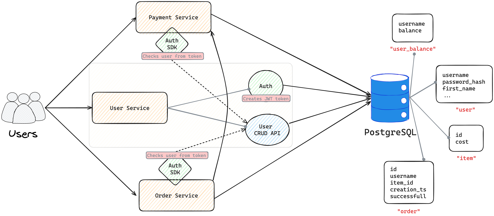

# Architecture

## Explanation

* User Service — Provides CRUD API to user data and is responsible for auth

* Payment Service — Allows to view, withdraw and replenish balance

* Order Service — Allows to create a new order and to view an order history
* User Service splits into 2 parts: Auth and User CRUD API (it implements them both)
  * Auth is a part responsible for signup, login and generating new access tokens
  * User CRUD API is a part responsible for managing user info

* Auth SDK allows Payment Service and Order Service to effectively auth user (extract user info from header)
  * Additionaly it checks that given user (specified as "sub" in token) exists since no token invalidation is implemented and this check helps to make sure that user is real and isn't removed
* Payment Service communicates directly only with database in order to manage user's balance
* Order Service communicates directly with database in order to manage user's orders and with payment service to update user's balance on creating a new order