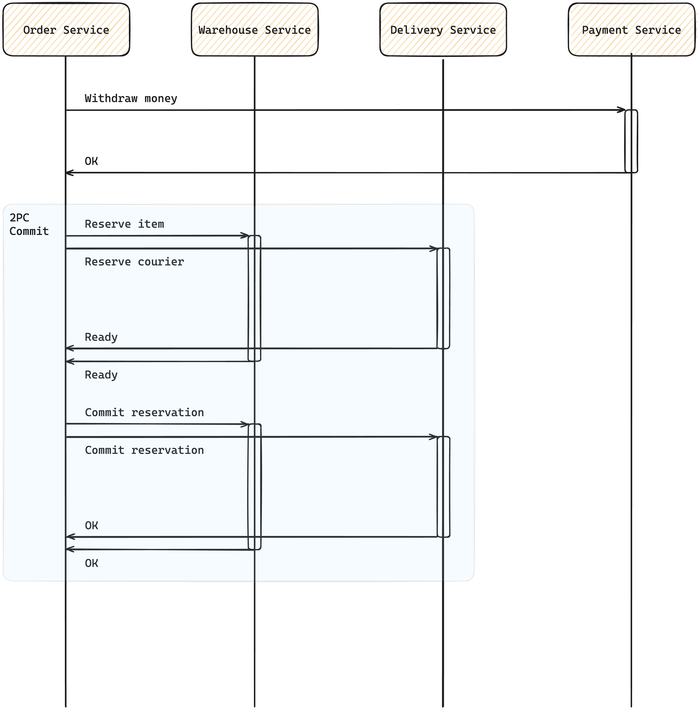
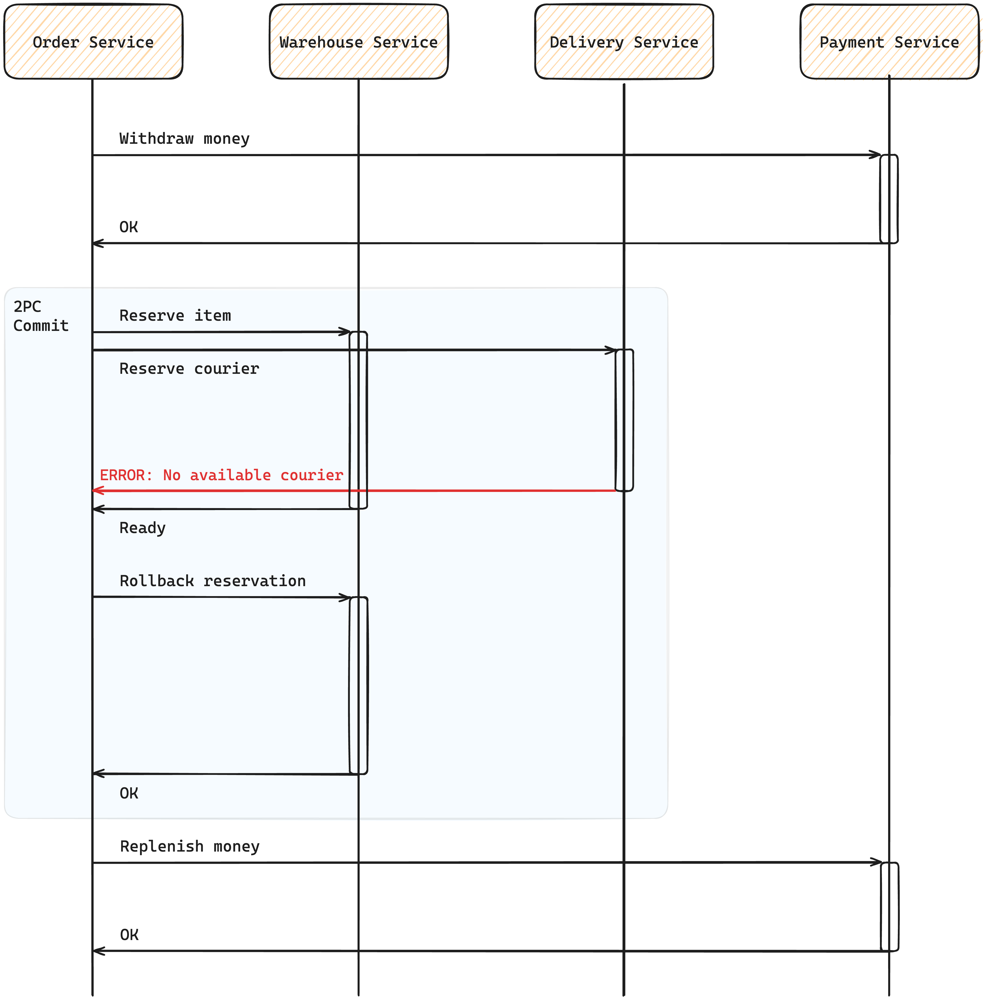

# Order Creation Algorithm

## Explanation

_Выбран Two-phase commit над Saga pattern_

​	Самое значимое преимущество Saga pattern заключается в его возможности развязать сервисы по времени и тем самым эффективно реализовать длительные транзакции, упростить интерфейс общения и увеличить throughput, но при этом сложность реализации значительно вырастает, архитектура также усложняется (за счет добавления очередей) и появляется длительная неконсистентность между данными (eventual consistency).

​	Для данной системы Saga pattern это полноценный overkill: предполагается, что транзакция будет выполняться относительно быстро, не ожидается чрезмерно высокий RPS, и соответственно незачем жертвовать простотой и консистентностью.

## Scenarios

### Normal Flow

### Not enough in stock

### No available courier

